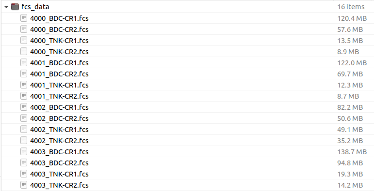

## Introduction

Flow cytometry data (regardless of the type of instrument used) is generally saved as a **.fcs** file. This file is populated with raw data, fluorescence intensity (for optics based technologies) and abundance (for mass cytrometry), as well as various metadata including: *user id*, *instrument id*, *dynamic range of instrument*, etc. It is important to be able to interact with and manipulate the **.fcs** file as it gives the users/analysts fine grain control!

## Installing/loading required libraries 

In the workshop, all the cytoverse packages are included in the instance you launched on the Bioconductor Workshop Galaxy, and the docker image this uses will remain available in perpetuity.  That said, if you want to to install `cytoverse` packages outside of docker, the standard Bioconductor tooling works:

```{r install_libraries, echo=TRUE, eval=FALSE, message=FALSE}
install.packages("BioManager")
BiocManager::install("flowCore")
BiocManager::install("flowWorkspace")
BiocManager::install("ggcyto")
BiocManager::install("openCyto")
BiocManager::install("flowStats")
```

For the moment, we only need to load `flowCore`.

```{r load_library_download_cache, eval=TRUE, echo=TRUE, message = FALSE}
library("flowCore")
library(CytoverseBioc2023)
cache_workshop_data()
```

## Reading in FCS files

There are 2 preffered approaches to read in **.fcs** file(s) into R:

- Read in individual **.fcs** files as `cytoframe`,
- Read in a set of **.fcs** files as `cytoset`,

(Additionally, you can read a workspace generated with another tool, such as FlowJo, using the cytoML package.)

A `cytoframe` and `cytoset` are all data structures that represent the cytometry data.  Some of these have overlapping functionality, and we'll eventually explain when you would prefer one data structure to another.

The function `load_cytoframe_from_fcs` is used to read in individual files as a `cytoframe` object. 

Normally, you might download a folder with a set of FCS files and interact with that.  For instance,

```{r, eval = TRUE, echo = FALSE}

```

For technical reasons, we can't easily distribute the **.fcs** files in this way for this workshop, but instead reference them through a file cache. This cache is essentially a set of folders, however, and we specify which files we want in it with `get_workshop_data`. (If you want to explore it, you can examine it with `BiocFileCache::bfcinfo(CytoverseBioc2023:::.get_cache())`.)

```{r load_cytoframe, eval=TRUE, echo=TRUE, message = FALSE}
cf <- load_cytoframe_from_fcs(get_workshop_data("data/fcs_data/4000_TNK-CR1.fcs")$rpath)

# a cytoframe object
cf
```

The `cytoframe` object has 3 slots where various data is stored. 

- `exprs(cf)` stores the expression matrix (i.e. the collected data),
- `parameters(cf)` stores information pertaining to channels: channel name, marker description,and data ranges as an AnnotatedDataFrame,
- `keyword(cf)` stores additional information extracted from the **.fcs** file header. The file header follow ISAC guidelines. Visit [here](https://isac-net.org/page/Data-Standards) for more information. 

## Working with `cytoframe`s

A few useful definitions that help us get oriented with the underlying data in the `cytoframe` object.

  - **Channels**: Instrument derived labels of various parameters that were measured. Channels are the column names of the `cytoframe`. Any data generated from the same instrument will have the same (similar) Channel names.
  - **Markers**: User provided labels for various parameters that were measured. 
For example: Channel name: B710-A, Marker name: CD3 (in `ff`). Marker names are set by the users and may not be unique across experiments/users. Not all channels are markers -- some are physical parameters such as the forward scatter or side scatter.  These channels will have their marker names set to `NA`.
  - **Expression**: Measured values. A matrix where every row is an event (frequently a cell) and every column is a channel.
  
Working with a `cytoframe` object is very similar to working with a `dataframe` in R, where a "row" is a cell and a "column" is a channel.  In particular, subsetting with square brackets `ff[i,j]` or `ff$` works as you might hope. 
An important difference, however, is that the subset operation **DOES NOT** create a new copy of the data but simply provides new window from which to view the data. 

### Examples

#### Accessing parameter summary and metadata

Summary of measured parameters.

```{r accessor_examples, echo=TRUE, eval=TRUE, message=FALSE}
# parameters
parameters(cf) |> pData() # show as a dataframe

```

Various metadata present in the **.fcs** files.

```{r}
# keywords
keyword(cf) |> head(10) # only show the first 10

```

#### Channels, Expression, and Subsets

```{r channels, echo=TRUE, message=FALSE}
# channels
colnames(cf)

# markernames
markernames(cf)

# expression
exprs(cf)[1:5,1:5]

```

Notice that there is a correspondence between channels, markers, and the expression matrix. i.e. the `names` of the named vector `markernames(cf)` are a subset of the columns of the expression matrix `exprs(cf)` as well as the columns of the `cytoframe`.

```{r correspondance, echo=TRUE,message=FALSE}
# interested marker: CD4
# easy to find which channel is mapped to CD4
marker_cd4 <- flowCore::getChannelMarker(frm = cf, name = "CD4")

# view the structure
marker_cd4

# extract expression of cd4
e_cd4 <- exprs(cf)[,marker_cd4[,"name"]]
head(e_cd4)

# subset cytorame by column
s_cf <- cf[,marker_cd4[,"name"]]
s_cf

# subset cytoframe by row
s2_cf <- cf[1:100,]
s2_cf
```

Notice that the subset (`<- [`) operation can be applied directly to the `cytoframe` object so that information regarding the file is preserved. Also, as indicated above, these operations provide a new view of the data without creating a **copy**. 

Below, we show examples of how to manipulate the `cytoframe` object and create a copy using `realize_view()`:

```{r manipulate_flowFrame, echo=TRUE, message=FALSE}
# create a new markername
new_name <- c("U785-A" = "test")

# create a new cytoframe subset
s_cf <- cf[1:150,] |> realize_view() # realize_view creates a new cytoframe, distinct from the original

# old markernames
markernames(s_cf)

# set new markername
markernames(s_cf) <- new_name
markernames(s_cf)

# manipulating expression values
# notice the data range 
s_cf
hist(exprs(s_cf))

# transform
exprs(s_cf) <- exprs(s_cf)/100

# notice the data range after transformation
s_cf
hist(exprs(s_cf))

```


Notice that the data range summary was not updated when we used `<-` to change the underlying expression matrix. A good practice is to use `transform` function to transform the underlying expression matrix. Importantly, `transform` also updates the data range summary. Moreover, `transform` can also be used to add new columns to the `cytoframe`. 

*Note*: We will go over `transformations` in a later section.
 
### Exercise

1. Why is `length(colnames(cf))` different than `length(markernames(cf))`?
2. How could you make a random downsample of 1000 cells from `cf`?
3. Make a scatter plot of the forward scatter (`FSC-A`) vs side scatter (`SSC-A`) of `cf` using a graphics package of your choice.


## Reading in a set of FCS files as a `cytoset`

In a experimental sense, a single **.fcs** file is not very interesting, since this represents only a single sample.  To draw any conclusions, we'll want replicates.   When there are a set of **.fcs** files they can be loaded into R either as a `cytoset`. 

**cytoset**: A collection of **.fcs** files, preferably, but not necessarily from the same panel/experiment.


```{r cytoset_example, echo=TRUE, message=TRUE}
library(flowWorkspace)
cs <- load_cytoset_from_fcs(files = get_workshop_data(path = "data/fcs_data/")$rpath)
cs
```

A `cytoset` can also be indexed with square brackets `cs[i,j]`, however now the row index `i` selects samples (**individual FCS files**) rather than cells.

Generally, each FCS file replicate has unique metadata properties that can (**and should**) be supplied to the `cytoset`. These can be added to by using `pData(x) <- data.frame`. The `rownames` of the dataframe **must match** the `sampleNames` of the `cytoet`.

```{r show_metadata_cs, echo=TRUE,message=TRUE}
# create metadata
metadata <- data.frame(row.names = sampleNames(cs),
                       Treatment = sample(c("Untreated","Treated"),length(cs), replace = TRUE),
                       panel = ifelse(grepl(pattern = "TNK",x = sampleNames(cs)),"T Cell Panel","Myeloid Panel"))

# prior to providing metadata
pData(cs)

# add metadata 
pData(cs) <- metadata

pData(cs)
```

The benefit of having metadata is that we can use many of the sub-setting operations in a metadata specific manner. 

*Note*: Many of the sub-setting operation for `cytoframe` are also applicable for `cytoset`. Similar to `cytoframe` sub-setting operations only create a new view of the data. For a complete copy, `realize_view` should be used.

This is much more convenient than going back and forth between the full set of files. 

```{r cytoset_subset, echo=TRUE, message=TRUE}
# subset by files that have myeloid staining panel without creating a copy of the data
cs_myeloid <- cs[pData(cs)[["panel"]] == "Myeloid Panel",]

cs_myeloid
pData(cs_myeloid)
```

Many of the sub-setting operation for `flowFrame` is also applicable for `flowSet` and `cytoset`. Important distinction, however, is that subset operation for `cytoset` creates a "view" of the underlying data,  and thus will point to the same set on disk.

Below is an example of `cytoset` sub-setting which also highlights how the operations performed on `cytoset` affects the underlying data.

```{r cytoset_subset_2, echo=TRUE,message=TRUE}
# demonstrate how cs point to the same underlying data
range(exprs(cs[[1]])[,"B515-A"])

# subset and show prior to transformation
cs_small <- cs[1]
range(exprs(cs_small[[1]])[,"B515-A"])

# create a transformList
trans <- transformList("B515-A",asinh)
# transform
cs_small <- transform(cs_small,trans)

# after transformation
range(exprs(cs_small[[1]])[,"B515-A"])

# whole cs 
range(exprs(cs[[1]])[,"B515-A"])
```

As you see, the transformation was applied to a subset `cs_small` however the original `cs` was also altered highlighting that both objects were pointing to the same data. To perform a **deep copy** we can use `realize_view()`

```{r cytoset_deep_copy, echo=TRUE, message=TRUE}
# look at underlying expression
range(exprs(cs[[2]])[,"B515-A"])

# subset and show prior to transformation
cs_small2 <- realize_view(cs[2])
range(exprs(cs_small2[[1]])[,"B515-A"])

# create a transformList
trans <- transformList("B515-A",asinh)
# transform
cs_small2 <- transform(cs_small2,trans)

# after transformation
range(exprs(cs_small2[[1]])[,"B515-A"])

# whole cs 
range(exprs(cs[[2]])[,"B515-A"])
```

Notice that `cs` is left unchanged. 

## Adding additional **.fcs** files to `cytoset`

Lastly, we can also add additional **.fcs** files to a `cytoset` using `cs_add_cytoframe`.

```{r add_more_fcs, echo=TRUE, eval=T}
# add to cytoset
cs_small <- realize_view(cs[1]) # cs[1] subsets cs into a cytoset while realize_view leads to a deep_copy into a new cytoset
cs_small

# no need to point to cs_small
cs_add_cytoframe(cs = cs_small, sn = "Sample Name", cf = cs[[3]]) # cs[[3]] results in a cytoframe
cs_small
```


## From `cytoset` to `cytoframe`

It is possible that you may want to extract a `cytoframe` or extract all files as a list of `cytoframe`. We can either use ``[[`` to directly grab a `cytoframe` or `cytoset_to_list`.

```{r cytoset_to_cytoframe, echo=TRUE, eval=TRUE, message = FALSE}
# extract a single cytoframe by using cs[[index/samplename]]
single_cf <- cs[[1]]

# convert to a list
list_of_cf <- cytoset_to_list(cs) 
```


### Exercises

1. How would you extract marker names that are stored within a the cytoset `cs`?
2. How would you create a `cytoset` from the object `list_of_cf`?
3. Alter expression of a specific marker the 1st `cytoframe` within the `list_of_cf`. Now plot a histogram of the expression. What do you think happens to the expression to the `cytoframe`: `cs[[1]]`?

## Saving your data

Saving your data is easy.

```{r save_cytoset,echo=TRUE, eval=FALSE,message=FALSE}
# save cytoframe
cf_write_disk(cf,
              "path/to/my_new_cf")

# save cytoset
save_cytoset(cs, path = "my/data/goes/here")
```

Loading it back is just as easy.

```{r load_cf_cs, echo=TRUE, eval=FALSE, message=FALSE}
# load cytoframe
load_cytoframe("path/to/my_cf")

# load cytoset
load_cytoset("path/to/my/cs")

```

## Conclusion

We went through multiple ways to import, interact with, and manipulate **.fcs** files using the `cytoverse` tools. It is important to note additional functionality, *which we will not going to go over at this workshop for the sake of time*, for further manipulation and even creation of **.fcs** files exist with the `cytoverse`. We encourage you to explore them further at your leisure by calling `browseVignettes("packagename")`. 
