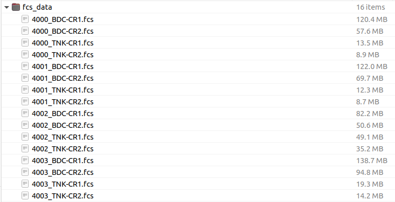

## Introduction

Flow cytometry data (regardless of the type of instrument used) is generally saved as a **.fcs** file. This file is populated the raw data, fluoresence intensity (for optics based technologies) and abundance (for mass cytrometry), as well as various parameters including: user id, instrument id, dynamic range of instrument, etc. It is important to be able to interact with and manipulate the **.fcs** file as it gives the users/analysts fine grain control!

## Installing/loading required libraries 

Let's begin this course by installing and loading the `cytoverse` packages **flowCore** hosted at **bioconductor.org**. This package allows us to read and manipulate the **.fcs** file in R. As well, we should also install additional libraries that will be required for this course. 

```{r install_libraries, echo=TRUE, eval=FALSE, message=FALSE}
install.packages("BioManager")
BiocManager::install("flowCore")
BiocManager::install("flowWorkspace")
BiocManager::install("ggcyto")
BiocManager::install("openCyto")
BiocManager::install("flowStats")
```


```{r load_library_download_cache, eval=TRUE, echo=TRUE, message = FALSE}
library("flowCore")
library(CytoverseBioc2023)
cache_workshop_data()
```

## Reading in FCS files

There are 3 approaches to read in **.fcs** file(s) into R:

- Read in individual **.fcs** files as **flowFrame**,
- Read in a set of **.fcs** files as **flowSet**,
- Read in a set of **.fcs** files as **cytoset**,

*Note: We will revisit flowSet and cytoset*

The function `read.FCS` is used to read in individual files as a `flowFrame` object. 

Normally, you might download a folder with a set of FCS files and interact with that.  For instance,

```{r}

```

For technical reasons, we can't easily distribute the **.fcs** files in this way for the workshop, but instead reference them through a file cache that is populated **once**. Note that this is just a glorified set of folders. If you want to explore it, you can examine it with `BiocFileCache::bfcquery(CytoverseBioc2023::bfc)`.

```{r read.FCS, eval=TRUE, echo=TRUE, message = FALSE}
ff <- read.FCS(get_workshop_data("data/fcs_data/4000_TNK-CR1.fcs")$rpath)

# a flowFrame object
ff
```

The `flowFrame` object has 3 slots where various data is stored. 

- `@exprs` stores the expression matrix (i.e. the collected data). Can be accessed via `exprs(ff)`,
- `@parameters` stores information pertaining to channels: channel name, marker description,and data ranges as AnnotatedDataFrame. Can be accessed via `parameters(ff)`,
- `@description` stores additional information extracted from the **.fcs** file header. Can be accessed via `description(ff)`. The file header follow ISAC guidelines. Visit [here](https://isac-net.org/page/Data-Standards) for more information. 

## Working with `flowFrame`

Working with a `flowFrame` object is going to be very similar to working with a `dataframe` in R. 

A few useful definitions that help us get oriented with the underlying data in the `flowFrame` object.

**Channels**: Instrument derived labels of various parameters that were measured. Channels are the column names of the `flowFrame`. Any data generated from the same instrument will have the same (similar) Channel names.
**Markers**: User provided labels for various parameters that were measured. 
For example: Channel name: B710-A, Marker name: CD3 (in `ff`). Marker names are set by the users and may not be unique across experiments/users. 
**Expression**: Measured values. A matrix where every row is an event (frequently a cell) and every column is a channel.

### Examples


```{r channels, echo=TRUE, message=FALSE}
# channels
colnames(ff)

# markernames
markernames(ff)

# expression
exprs(ff)[1:5,1:5]

```

Notice that there is a correspondence between channels, markers, and the expression matrix. i.e. the `names` of the named vector `markernames(ff)` are a subset of the columns of the expression matrix `exprs(ff)` as well as the columns of the `flowFrame`!

```{r correspondance, echo=TRUE,message=FALSE}
# interested marker: CD4
marker_cd4 <- markernames(ff)[grepl(pattern = "CD4 ",x = markernames(ff))]
marker_cd4

# extract expression of cd4
e_cd4 <- exprs(ff)[,names(marker_cd4)]
head(e_cd4)

# subset flowFrame by column
s_ff <- ff[,names(marker_cd4)]
s_ff

# subset flowFrame by row
s2_ff <- ff[1:100,]
s2_ff
```

Notice that the subset (`<- [`) operation can be applied directly to the `flowFrame` object so that information regarding the file is preserved.

Below, we show examples of how to manipulate the `flowFrame` object:

```{r manipulate_flowFrame, echo=TRUE, message=FALSE}
# create a new markername
new_name <- c("U785-A" = "test")

# old markernames
markernames(s_ff)

# set new markername
markernames(s_ff) <- new_name
markernames(s_ff)

# manipulating expression values
# notice the data range 
s_ff
hist(exprs(s_ff))

# transform
exprs(s_ff) <- exprs(s_ff)/100

# notice the data range after transformation
s_ff
hist(exprs(s_ff))

```

Notice that the data range summary was not updated when we used `<-` to change the underlying expression matrix. A good practice is to use `transform` function to transform the underlying expression matrix. Importantly, `transform` also updates the data range summary. Moreover, `transform` can also be used to add new columns to the `flowFrame`.

Example

*Note*: We will go over `transformations` in a later section.
 
```{r transform_flowFrame, echo=TRUE,message=FALSE}
# define the transformation
simple_trans <- function(x)x/100

# create a transformList
# this indicates which columns to transform and what transformation to do
t_list <- flowCore::transformList(from = c("U785-A"),
                                  tfun = simple_trans)

# before transformation
range(s_ff)

# after transformation
s_ff_trans <- flowCore::transform(s_ff,
                                  t_list)
range(s_ff_trans)

# add a new column
s_ff_trans <- flowCore::transform(s_ff,
                                  "New_col" = simple_trans(`U785-A`)
                                  )
s_ff_trans
```

## Reading in a set of FCS files as `flowSet` or `cytoset`

In an experimental sense, a single **.fcs** file is not very interesting (of course, this is not always true!). When there are a set of **.fcs** files they can be loaded into R either as a `flowSet` or a `cytoset`. 

**flowSet/cytoset**: A collection of **.fcs** files, preferably, but not necessarily from the same panel/experiment.

*Note*: The difference between `flowSet` and `cytoset` is the underlying representation of the data. `cytoset` is implemented in the package `flowWorkspace` which we will encounter in more detail later. Additionally, `cytoset` is built upon a collection of `cytoframe`, analogous to `flowFrame`.

Let's start by going over options to create `flowSet`:

```{r flowSet_example, echo=T, message=TRUE}
# steps to create flowSet

# option 1
# load fcs files as a list
fcs_list <- lapply(X = get_workshop_data(path = "data/fcs_data/")$rpath,
                   FUN = read.FCS)

# convert to flowSet
fs <- as(fcs_list,"flowSet")
fs

# option 2 (preferred)
fs <- read.flowSet(files = get_workshop_data(path = "data/fcs_data/")$rpath) # read in directly as a flowSet
fs
```

Options to create a `cytoset`

```{r cytoset_example, echo=TRUE, message=TRUE}
require(flowWorkspace)
# option 1 (preferred)
cs <- load_cytoset_from_fcs(files = get_workshop_data(path = "data/fcs_data/")$rpath)

# option 2 (convert flowSet to cytoset)
cs <- flowSet_to_cytoset(fs)
cs
```

Generally, each experiment has unique metadata properties that can (**and should**) be supplied to the `flowSet` or `cytoset`. These can be added to by using `pData(x) <- data.frame`. The `rownames` of the dataframe should match the `sampleNames` of the `flowSet`

```{r show_metadata_fs, echo=TRUE,message=TRUE}
# create metadata
metadata <- data.frame(row.names = sampleNames(fs),
                       Treatment = sample(c("Untreated","Treated"),length(fs), replace = TRUE),
                       panel = ifelse(grepl(pattern = "TNK",x = sampleNames(fs)),"T Cell Panel","Myeloid Panel"))

# prior to providing metadata
pData(fs)

# add metadata 
pData(fs) <- metadata

pData(fs)
```

The benefit of having metadata is that we can use many of the sub-setting operations in a metadata specific manner. 

*Note*: Many of the sub-setting operation for `flowFrame` is also applicable for `flowSet` and `cytoset`. Important distinction, however, is that subset operation for `cytoset` will not create a copy of the data and will point to the same set on disk.

This is much more convenient than going back and forth between the full set of files. 

```{r flowset_subset, echo=TRUE, message=TRUE}
# subset by files that have myeloid staining panel
fs_myeloid <- fs[pData(fs)[["panel"]] == "Myeloid Panel"
                 ,]

fs_myeloid
pData(fs_myeloid)
```

Below is an example of `cytoset` sub-setting which also highlights how the operations performed on `cytoset` affects the underlying data.

```{r cytoset_subset, echo=TRUE,message=TRUE}
# demonstrate how cs point to the same underlying data
range(exprs(cs[[1]])[,"B515-A"])

# subset and show prior to transformation
cs_small <- cs[1]
range(exprs(cs_small[[1]])[,"B515-A"])

# create a transformList
trans <- transformList("B515-A",asinh)
# transform
cs_small <- transform(cs_small,trans)

# after transformation
range(exprs(cs_small[[1]])[,"B515-A"])

# whole cs 
range(exprs(cs[[1]])[,"B515-A"])
```

As you see, the transformation was applied to a subset `cs_small` however the original `cs` was also altered highlighting that both objects were pointing to the same data. To perform a **deep copy** we can use `realize_view()`

```{r cytoset_deep_copy, echo=TRUE, message=TRUE}
# look at underlying expression
range(exprs(cs[[2]])[,"B515-A"])

# subset and show prior to transformation
cs_small2 <- realize_view(cs[2])
range(exprs(cs_small2[[1]])[,"B515-A"])

# create a transformList
trans <- transformList("B515-A",asinh)
# transform
cs_small2 <- transform(cs_small2,trans)

# after transformation
range(exprs(cs_small2[[1]])[,"B515-A"])

# whole cs 
range(exprs(cs[[2]])[,"B515-A"])
```

Notice that `cs` is left unchanged. 

## Adding additional **.fcs** files to `flowSet` and `cytoset`

Lastly, we can also add additional **.fcs** files to a `flowSet` or `cytoset` using `rbind2(flowSet1,flowFrame)` or `cs_add_cytoframe`.

```{r add_more_fcs, echo=TRUE, eval=T}
# add to flowSet
fs_small <- fs[1]
fs_small

# add a flowFrame to a flowSet
fs_small <- rbind2(fs_small, fs[[2]]) # fs[[2]] results in a flowFrame
fs_small

# add a flowSet to a flowSet
fs_small <- rbind2(fs_small, fs[3]) # fs[3] results in a flowSet
fs_small

# add to cytoset
cs_small <- realize_view(cs[1]) # cs[1] subsets cs into a cytoset while realize_view leads to a deep_copy into a new cytoset
cs_small

# no need to point to cs_small
cs_add_cytoframe(cs = cs_small, sn = "Sample Name", cf = cs[[3]]) # cs[[3]] results in a cytoframe
cs_small
```

## Conclusion

We went through multiple ways to import, interact with, and manipulate **.fcs** files using the `cytoverse` tools. It is important to note additional functionality, *which we will not going to go over at this workshop for the sake of time*, for further manipulation and even creation of **.fcs** files exist with the `cytoverse`. We encourage you to explore them further at your leisure by calling `browseVignettes("packagename")`. 
