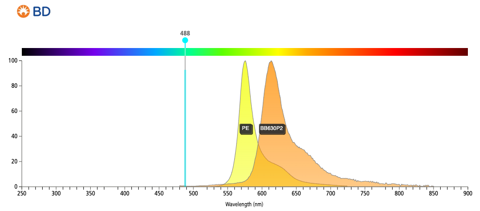

# Background

In this section, we aim to clarify the concept of Spillover, and the use of spillover/compensation matrices to correct for this. The last part of this section will deal with various transformations of the underlying expression data.

## Spillover

[CLARIFY THIS FURTHER] Flow cytometers (optics based: spectral or non-spectral) collect fluorescent signal from a cell as result of a laser excitation. Briefly, cell type C has been labelled with a marker M that is conjugated to a fluorophore (F). F has the property that it is excitation maxima at certain wavelength (W) resulting in fluoroscence. While the fluoresence has a emmision maxima, the emission profile of F can span many nanometers. The cytometer has a dedicated detector (channel) A to detect peak emission of F. However, due to the spread of the emission of F, some signal from F is also "spilled" onto detector B, a detector for a different fluorophore.

The image below provides a concrete example.


The "spillover" of signal onto secondary detector(s) is additive and can be easily recovered (more on this below).

Raw Signal in B = Signal from FITC (spillover) + Signal for a dedicated fluorophore.

Signal recovery (Compensation) requires a set of controls be present to calculate the spillover. These controls are called **Single Colour Controls** and are often acquired prior to sample acquisition. The purpose of the single colour control is to estimate the amount of spillover of emission from fluorophore F onto non-primary detectors (detector B in the image above).

[TO ADD INFORMATION ABOUT SPECTRAL] Note: ABOUT Spectral instruments are set up slightly differently...

## Importance of spillover correction

Let's visualize the data to highlight the main issues related to spillover. I am using the `ggcyto` library from the `cytoverse`. We will dive into more details on the usage of `ggcyto` in a later section.

```{r viz_uncompensated_data, echo=FALSE, eval=T, message=FALSE, fig.width=10}
# load required libraries
library(flowCore)
library(ggcyto)

# read file
ff <- read.FCS("data/fcs_data/4000_BDC-CR1.fcs")[,-32]

# define transformation
trans <- transformList(from = names(markernames(ff)),tfun = (function(x)asinh(x/500)))
# transform
ff_trans <- transform(ff,trans)

# plot
uncompensated <- as.ggplot(ggcyto(ff_trans, aes(x = "CD3", y = "CD5"))+
  geom_hex(bins = 128)+
  theme_bw()+
  labs(title = "Uncompensated data"))

# compensate
ff_comp <- compensate(ff, spillover(ff)[[3]])
# transform
ff_comp <- transform(ff_comp,trans)

# plot
compensated <- as.ggplot(ggcyto(ff_comp, aes(x = "CD3", y = "CD5"))+
  geom_hex(bins = 128)+
  theme_bw()+
  labs(title = "Compensated data")+
    axis_x_inverse_trans())

gridExtra::grid.arrange(uncompensated,compensated,nrow = 1, top = "1. Difficulty resolving the correct populations")

```

Another example:

```{r uncompensated_data_issue,echo=FALSE,eval=TRUE, fig.width=10}

uncompensated <- as.ggplot(ggcyto(ff_trans, aes(x = "SSC-A", y = "Live"))+
  geom_hex(bins = 128)+
  theme_bw()+
  labs(title = "Uncompensated data"))

compensated <- as.ggplot(ggcyto(ff_comp, aes(x = "SSC-A", y = "Live"))+
  geom_hex(bins = 128)+
  theme_bw()+
  labs(title = "Compensated data"))

gridExtra::grid.arrange(uncompensated, compensated, nrow = 1, top = "2. Wrong conclusions")

```

In example 1,the plot first plot shows the uncompensated data. In this example, the 2 fluorophores: PE-Cy5 and PE-Cy5.5 are spilling onto each other, making the data not resolvable. However, after correcting for spillover, we see that the data can be resolved (2nd plot).

In example 2, we see a population of events that are positive of marker: Live Dead UV Blue. Generally, these events are discarded as this marker is used to identify dead cells. However, in correctly compensated data, we see that this population does not exist!

## Where to find your spillover matrix?

In many cases, the spillover matrix (which is used to correct the spillover) is attached to the FCS files within `$SPILLOVER`,`SPILL`,or `SPILL` keywords. In `cytoverse`, we can check for the presence of by using the function `spillover(ff)`.

Example:

```{r show_spill, echo=T, message=TRUE}
# show spillover
spillover(ff)
```

We notice a few important details. 
  - `spillover(ff)` returns all 3 keywords, even if some do not contain a matrix 
  - It is not necessary that all 3 keywords have a matrix 
  - spillover matrix is square. This is because the user will run 1 single colour control for each channel/marker they intend to acquire. In this example its 28 x 28

The columns of the spillover matrix are the detectors while the rows are contribution from each fluorophore. Visualizing it as a heatmap is sometimes more helpful

```{r explain_spillover, echo=FALSE, eval=TRUE}
# extract spillover
s.mat <- spillover(ff)[[3]]
rownames(s.mat) <- markernames(ff)

pheatmap::pheatmap(mat = s.mat,cluster_rows = F,cluster_cols = F,color = colorRampPalette(c("black","orange","cyan","magenta"))(100))
```

Looking at the figure, column 2: B610-A has high spillover from flurophore: PE-Dazzle594 and PE.

In fact, when we look at the emission spectrum of the 2 dyes we see that this issue is apparent:


The image was created at <https://www.bdbiosciences.com/en-ca/resources/bd-spectrum-viewer> using the BD spectrum viewer tool.

### Calculating spillover from single colour controls

Another way to calculate spillover is by using a set of single colour controls. This is generally a part of experiment/instrument set up before acquisition begins.

Generally, there ought to be the same number of single colour controls as the number of markers being assessed + 1 unstained to estimate the background autofluoresence of cells. 

The dataset that we are primarily going to be working with (i.e. [FR-FCM-Z5PC](https://flowrepository.org/public_experiment_representations/5932)) did not come with a set of control files to generate the spillover matrix. So for demonstration purposes, we will use single colour controls from a different dataset [FR-FCM-ZZ36](https://flowrepository.org/id/FR-FCM-ZZ36). 

```{r generating_spillover_with_controls, echo=TRUE, eval =TRUE, message=FALSE}
# required libraries
library(flowCore)

# load sample fcs files
ff <- read.FCS("data/FlowRepository_FR-FCM-ZZ36_files/pbmc_luca.fcs")

# markernames/colnames
channels <- colnames(ff)

# list the set of control files
control_files <- data.frame(controls = 
                              list.files(path = "data/FlowRepository_FR-FCM-ZZ36_files",
                                         pattern = "Controls",
                                         full.names = TRUE)
)
## Will use the package DataEditR for matching file names to colnames
control_files <- DataEditR::data_edit(x = control_files, 
                     col_edit = TRUE,
                     col_bind = "channels",
                     col_options = list(channels = channels)
                     )
rownames(control_files) <- control_files[["channels"]]

# rearrange order to match flowFrame
control_files<- control_files[c("Unstained",colnames(ff)[7:20]),]

# load the set of compensation files
comp_frames <- lapply(control_files[["controls"]],read.FCS)
names(comp_frames) <- control_files[["channels"]]

# convert to flowSet
comp_fs <- as(comp_frames,"flowSet")

# transform data 
## will go over this next
trans <- flowCore::transformList(from = colnames(ff)[7:20],tfun = flowCore::arcsinhTransform(b = 1/150))
comp_fs <- transform(comp_fs,trans)

# visualize data before proceeding further
unstained <- ggcyto::as.ggplot(ggcyto(comp_fs[[1]],
                  aes(x = "FSC-A", y = "SSC-A"))+
                    geom_hex(bins = 256)+
                    theme_bw()+
                    labs(title = "Unstained Sample"))

af488_control <- ggcyto::as.ggplot(ggcyto(comp_fs[[2]],
                  aes(x = "FSC-A", y = "SSC-A"))+
                    geom_hex(bins = 256)+
                    theme_bw()+
                    labs(title = "AF488 stained control"))
gridExtra::grid.arrange(unstained,af488_control, nrow = 1)

# Identify population that will have + staining
## will go over gating in detail in the. next section
comp_fs_beads <- fsApply(comp_fs,function(x){
  bead_gate <- openCyto::gate_flowclust_2d(x,xChannel = "FSC-A", yChannel = "SSC-A",filterId = "Beads",K = 1)
  bead_filter <- filter(x,bead_gate)
  return(Subset(x,bead_filter))
})

# calculate spillover
## using spillover from flowStats
spill <- flowStats::spillover(comp_fs_beads,
                   unstained = "Unstained", # indicate how the unstained file is named in flowset
                   patt = "-A", # indicate which parameter should be considered 
                   method = "mean",
                   stain_match = "ordered")
```

Now, let's visualize the spill matrix that we calculated.

```{r viz_calculated_spill, eval=T, echo=FALSE}
pheatmap::pheatmap(mat = spill,cluster_rows = F,cluster_cols = F,color = colorRampPalette(c("black","orange","cyan","magenta"))(100),display_numbers = T, legend = FALSE, number_color = "white",number_format = "%.3f")

```

```{r test_comp}

trans <- flowCore::transformList(from = colnames(ff)[7:20],tfun = flowCore::arcsinhTransform(b = 1/150))
ff <- read.FCS("data/FlowRepository_FR-FCM-ZZ36_files/pbmc_luca.fcs")
ff_trans <- transform(ff,trans)
autoplot(ff_trans, x = "Alexa Fluor 430-A", y = "PerCP-Cy5-5-A", bins = 256)

# compensate pre-transformation
ff_comp_pre_trans <- compensate(ff,pre_spill)
ff_comp_pre_trans <- transform(ff_comp_pre_trans,trans)
autoplot(ff_comp_pre_trans, x = "Alexa Fluor 430-A", y = "PerCP-Cy5-5-A", bins = 256)

# compensate post-transformation
ff_comp_post_trans <- compensate(ff_trans,pre_spill)
autoplot(ff_comp_post_trans, x = "Alexa Fluor 430-A", y = "PerCP-Cy5-5-A", bins = 256)

```


Above, we took a "easy" route to consider all data points for calculating spillover. While this leads to an estimate, it may not be the best estimate. 

```{r compare_with_precalculated_spill, echo=FALSE, eval=TRUE}
# load pre-calculated matrix
pre_spill <- read.csv("data/pre-calculated-matrix.csv/spill_matrix_beads.csv",as.is = T,check.names = FALSE,row.names = 1)

# rearrange colnames and rownames
pre_spill <- pre_spill[rownames(spill),colnames(spill)]

pheatmap::pheatmap(mat = pre_spill,cluster_rows = F,cluster_cols = F,color = colorRampPalette(c("black","orange","cyan","magenta"))(100), legend = FALSE,display_numbers = TRUE,number_color = "white",number_format = "%.3f")
```

The spill matrix above was calculated by specifying a specific population where the `spillover` function expects positive and negative peaks.
To get an idea, lets quickly visualize 2 of the controls

```{r}
library(ggcyto)
unstained_plot <- as.ggplot(
  ggcyto(comp_fs[[1]], aes(x = "FSC-A", y = "SSC-A"))+
    geom_hex(bins = 256)+
    theme_bw()+
    geom_hline(yintercept = mean(exprs(comp_fs[[1]])[,"Alexa Fluor 488-A"]))+
    labs(title = "Alexa Fluor 488-A fluoresence in an Unstained sample")
)

af488_control <- as.ggplot(
  ggcyto(comp_fs[[2]], aes(x = "FSC-A", y = "488-A"))+
    geom_hex(bins = 256)+
    theme_bw()+
    geom_hline(yintercept = mean(exprs(comp_fs[[2]])[,"Alexa Fluor 488-A"]))+
    labs(title = "Alexa Fluor 488-A fluoresence in a Alexa Fluor 488-A single color control")
)

af430_control <- as.ggplot(
  ggcyto(comp_fs[[7]], aes(x = "FSC-A", y = "488-A"))+
    geom_hex(bins = 256)+
    theme_bw()+
    geom_hline(yintercept = mean(exprs(comp_fs[[1]])[,"Alexa Fluor 488-A"]))+
    labs(title = "Alexa Fluor 488-A fluoresence in an Unstained sample")
)
gridExtra::grid.arrange(unstained_plot,af488_control,af430_control, nrow = 1)
```


